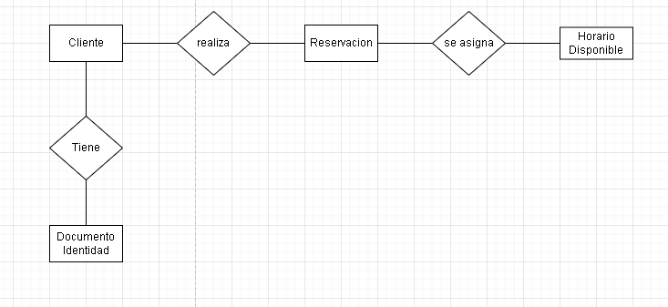
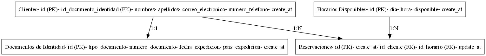
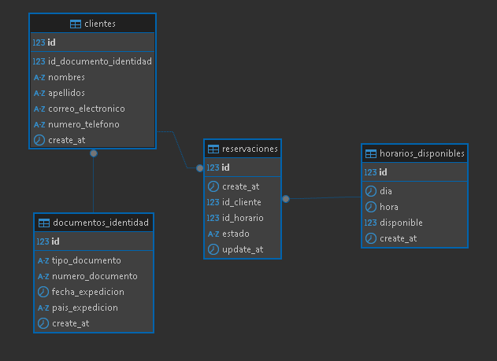

# Proyecto de Reservaciones

Este proyecto gestiona las reservaciones en un restaurante.

## Software requerido

- Java 17
- Maven
- MySQL

## Instrucciones para ejecutar tu programa y probar la solución.

1. Clonar el repositorio
2. Ejecutar el script de creacion de tablas
3. Ejecutar el script de alimentacion de tablas
4. Ejecutar el archivo script.sh para limpiar, compilar y ejecutar el aplicativo
5. Abrir el navegador e ir a la direccion http://localhost:8080

## Diagrama ER




## Plan de Escalabilidad

### Situación Actual
El sistema actual maneja reservaciones de restaurante con una arquitectura monolítica y base de datos relacional.

### Desafíos
- Aumento en consultas de horarios disponibles
- Incremento en creación de reservaciones
- Necesidad de mantener consistencia en horarios
- Mayor demanda en horas pico

### Plan de Mejoras

#### Fase 1: Optimización Inicial
- Implementar WebFlux para manejo asíncrono de solicitudes
- Implementar Caché
- Implementar WebSocket para notificaciones en tiempo real
- Implementar Excepciones personalizadas
- Implementar Validaciones mas estricas

#### Fase 2: Sistema de Mensajería
- Integración con RabbitMQ/Kafka
- Implementar notificaciones por correo electronico
- Implementar notificaciones por SMS

#### Fase 3: Arquitectura de Microservicios
- Separación en servicios:
  - Servicio de Reservaciones
  - Servicio de Horarios
  - Servicio de Clientes
  - Servicio de Notificaciones


## Diagrama de tablas



## Scripts SQL

### Scripts para la creacion de las tablas

#### Script para crear la tabla de horarios disponibles
```
CREATE TABLE horarios_disponibles (
	id BIGINT NOT NULL AUTO_INCREMENT,
	dia DATE NOT NULL,
	hora TIME(6) NOT NULL,
	disponible TINYINT(1) NOT NULL,
	create_at DATETIME(6) DEFAULT NULL,
	PRIMARY KEY (id),
	UNIQUE KEY UK_dia_hora (dia, hora)
);
```

#### Script para crear la tabla de documentos de identidad
```
CREATE TABLE documentos_identidad (
	id BIGINT NOT NULL AUTO_INCREMENT,
	tipo_documento VARCHAR(5) NOT NULL,
	numero_documento VARCHAR(20) NOT NULL,
	fecha_expedicion DATE DEFAULT NULL,
	pais_expedicion VARCHAR(100) DEFAULT NULL,
	create_at DATETIME(6) DEFAULT NULL,
	PRIMARY KEY (id),
	UNIQUE KEY UK_numero_documento (numero_documento)
);
```

#### Script para crear la tabla de clientes
```
CREATE TABLE clientes (
	id BIGINT NOT NULL AUTO_INCREMENT,
	id_documento_identidad BIGINT NOT NULL,
	nombres VARCHAR(50) NOT NULL,
	apellidos VARCHAR(50) DEFAULT NULL,
	correo_electronico VARCHAR(50) DEFAULT NULL,
	numero_telefono VARCHAR(10) NOT NULL,
	create_at DATETIME(6) DEFAULT NULL,
	PRIMARY KEY (id),
	UNIQUE KEY UK_documento_identidad (id_documento_identidad),
	UNIQUE KEY UK_correo_electronico (correo_electronico),
	CONSTRAINT FK_cliente_documento_identidad FOREIGN KEY (id_documento_identidad)
		REFERENCES documentos_identidad(id)
);
```

#### Script para crear la tabla de reservaciones
```
CREATE TABLE reservaciones (
	id BIGINT NOT NULL AUTO_INCREMENT,
  	create_at DATETIME(6) DEFAULT NULL,
	id_cliente BIGINT NOT NULL,
	id_horario BIGINT NOT NULL,
	estado VARCHAR(20) NOT NULL DEFAULT 'CREADA',
	update_at DATETIME(6) DEFAULT NULL,
	PRIMARY KEY (id),
	UNIQUE KEY UK_id_horario (id_horario),
	KEY FK_cliente (id_cliente),
	CONSTRAINT FK_reservacion_horario FOREIGN KEY (id_horario) 
	  REFERENCES horarios_disponibles(id),
	CONSTRAINT FK_reservacion_cliente FOREIGN KEY (id_cliente)
	  REFERENCES clientes(id)
);
```

### Scripts para alimentar las tablas

#### Script para alimentar la tabla de documentos de identidad

```
INSERT INTO documentos_identidad (tipo_documento, numero_documento, fecha_expedicion, pais_expedicion) VALUES 
('CC', '1234567890', NOW(), 'Colombia')
```

#### Script para alimentar la tabla de clientes

```
INSERT INTO clientes (id_documento_identidad, nombres, apellidos, correo_electronico, numero_telefono) VALUES 
(1, 'Juan', 'Perez', 'juan@gmail.com', '3178901234')
```

#### Script para alimentar la tabla de horarios disponibles

```
INSERT INTO horarios_disponibles (dia, hora, disponible, create_at) VALUES
('2025-01-15', '11:00:00', 1, NOW()),
('2025-01-15', '12:00:00', 1, NOW()),
('2025-01-15', '13:00:00', 1, NOW()),
('2025-01-15', '14:00:00', 1, NOW()),
('2025-01-15', '15:00:00', 1, NOW()),
('2025-01-15', '16:00:00', 1, NOW()),
('2025-01-15', '17:00:00', 1, NOW()),
('2025-01-15', '18:00:00', 1, NOW()),
('2025-01-15', '19:00:00', 1, NOW()),
('2025-01-15', '20:00:00', 1, NOW()),
('2025-01-15', '21:00:00', 1, NOW()),
('2025-01-15', '22:00:00', 1, NOW()),
('2025-01-15', '23:00:00', 1, NOW()),
('2025-01-15', '25:00:00', 1, NOW());
```

### Script para verificar(Consultar) los horarios disponibles en un dia especifico

``` SELECT * FROM horarios_disponibles WHERE dia = '2025-01-15' AND disponible = 1; ```

### Script para crear una reservacion

``` INSERT INTO reservaciones (create_at, id_cliente, id_horario, update_at) VALUES (NOW(), 1, 2, NOW()); ```

### Script para actualizar el estado de una reservacion
```
UPDATE horarios_disponibles h
INNER JOIN reservaciones r ON h.id = r.id_horario
SET h.disponible = 1,
    r.estado = 'CANCELADA',
    r.update_at = NOW()
WHERE r.id = 1;
```

### Script para eliminar una reservacion

``` DELETE FROM reservaciones WHERE id = 1; ```

## Estructura del Proyecto

- `src/main/java/com/restaurant/reservations/`: Código Java para la aplicación.
- `src/main/java/com/restaurant/reservations/controller/`: Controladores para la aplicación.
- `src/main/java/com/restaurant/reservations/model/`: Modelos para la aplicación.
- `src/main/java/com/restaurant/reservations/repository/`: Repositorios para la aplicación.
- `src/main/java/com/restaurant/reservations/service/`: Servicios para la aplicación.
- `src/main/java/com/restaurant/reservations/mapper/`: Mapper para la aplicación.

- `src/main/resources/static/js/main.js`: Código JavaScript para la funcionalidad del calendario.
- `src/main/resources/static/index.html`: Archivo HTML principal.
- `src/main/resources/static/css/main.css`: Estilos CSS para la aplicación.

## tecnologias usadas

- Java 17
- Maven
- MySQL
- Spring Boot
- Spring Data JPA
- Hibernate
- Lombok
- MapStruct

